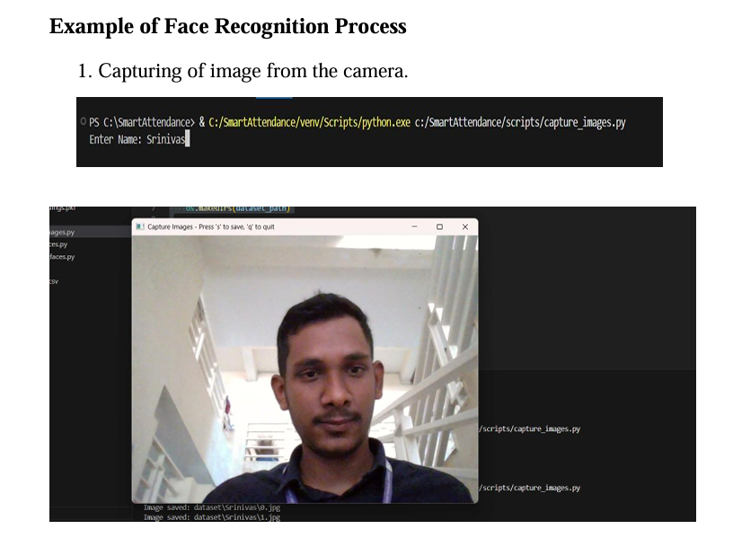
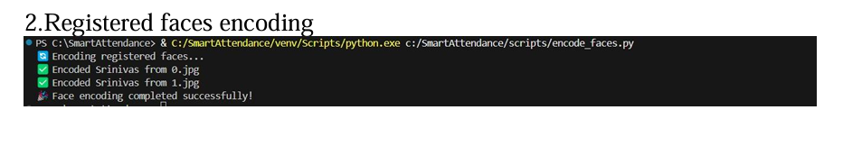
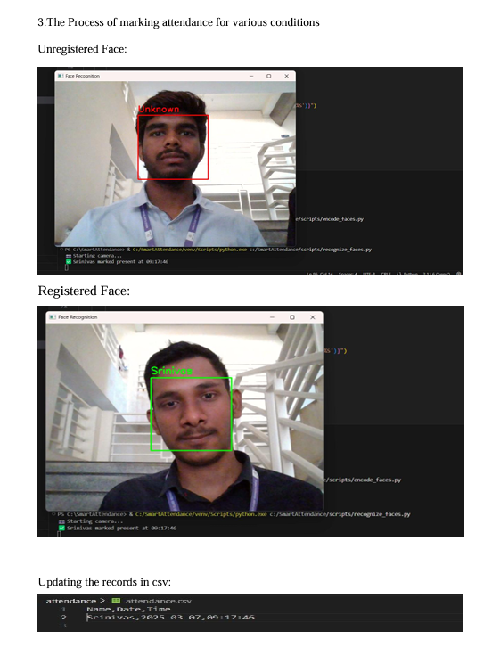

# 🎓 Smart Attendance Using Facial Recognition
A Python-based smart attendance system that automatically detects and recognizes student faces using computer vision, making attendance marking fast, contactless, and accurate.
---
## 📸 Execution Screenshots

### ➤ Capturing Images  

### ➤ Encoding Images  

### ➤ Marking Attendance  

## 🚀 Key Features

- 🎯 Real-time face detection & recognition using webcam
- 🧠 Trained using face datasets (LBPH or Face_Recognition)
- 📅 Marks attendance with name, date, and time
- 🧾 Stores records securely in `.csv` file
- 🧍 Prevents duplicate attendance on same day
- 🖼️ Simple GUI using `Tkinter` for ease of use
- 🔐 Data privacy & local processing (no cloud required)

---
## 🧰 Tech Stack

| Technology        | Usage                           |
|------------------|----------------------------------|
| Python            | Core programming logic           |
| OpenCV            | Image capture and face detection |
| face_recognition  | Face comparison & recognition    |
| NumPy             | Array and matrix operations      |
| Pandas            | Data management & storage        |
| Tkinter           | GUI (Graphical User Interface)   |

---

## 📁 Project Structure
Smart-Attendance-Using-Facial-Recognition/
-├── assets/
-│ └── screenshots/
-├── attendance/
-│ └── attendance.csv
-├── dataset/
-│ └── [stored user images]
-├── trainer/
-│ └── trained_model.yml
-├── main.py
-├── train_model.py
-├── requirements.txt
---
-🧑‍💻 Author
-Srinivas Gaddam
-gmail:gaddamsrinivas011@gmail.com
